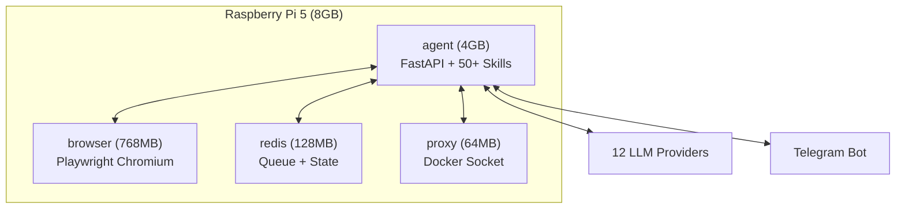

> **TL;DR**
> - Raspberry Pi 5 (8GB) 上で50+スキルの自律AIエージェントを半年運用中
> - 構成: FastAPI + Docker 4コンテナ + 12 LLMプロバイダー + Telegram UI
> - 月額コスト: 500円以下（電気代100円 + Gemini課金数百円）
> - VTuber運用・開発効率化・インフラ監視を24/365で自動化
> - SNS投稿、ナレッジ収集、夜間の自律コード修正まで全部やってくれる

---

## クラウド代、毎月いくら払ってる？

AIエージェントをクラウドで常時稼働させると、LLM APIだけで月数万円は飛びます。加えてサーバー代。個人開発者にとっては結構キツいですよね。

私は半年前にこの問題にぶち当たって、「ラズパイで全部オンプレにすればいいのでは？」と思い立ちました。消費電力5〜15W、月の電気代100円以下、24時間つけっぱなしで壊れない。最初は半信半疑でしたが、結果的に**月500円以下**で自律AIエージェントが動く環境が出来上がりました。

[前回の記事](https://zenn.dev/nanora/articles/20260330-2d3be5f2)ではRAGナレッジ基盤にフォーカスしましたが、今回はその上に乗っている**自律エージェントシステム「NoraClaw」**の全体像を紹介します。

---

## アーキテクチャ概要

Docker Compose 4コンテナ構成です。agentコンテナが司令塔で、50以上のスキル（=機能モジュール）を持つFastAPIサーバーが動いています。browserコンテナはPlaywright + Chromiumでブラウザ操作を担当。redisがタスクキューと状態管理、proxyがDocker Socket経由のコンテナ監視を受け持ちます。

メモリ配分が命です。8GBしかないので、各コンテナにきっちり上限を設定しています。agentに4GB、browserに768MB、redisに128MB、proxyに64MB。この配分に落ち着くまでに何度かOOMキラーに殺されました。

---

## 12プロバイダーLLMルーター

NoraClaw最大の特徴がLLMルーターです。**12個のLLMプロバイダー**を束ねて、タスク種別に応じて最適なプロバイダーを自動選択します。

| Tier | プロバイダー例 | 用途 |
|------|--------------|------|
| 1 | Groq, Gemini 等（複数キー） | メイン。無料枠を組み合わせて冗長化 |
| 2 | Cerebras, SambaNova, Windows Ollama | Tier 1がレート制限に達したときのフォールバック |
| 3 | OpenRouter, Claude Code Proxy | 高品質な文章生成、最終防衛線の手前 |
| 4 | Pi Ollama (ローカル 1.5B) | 全部死んでも動く最終手段 |

サーキットブレーカーパターンを実装していて、あるプロバイダーがエラーを返し始めたら自動的に次のTierにフォールバックします。タスク種別（コーディング、日本語テキスト生成、リアルタイム応答など）ごとにルーティング優先順が違います。

たとえばツイート生成はClaude Code Proxy経由でOpusに投げますし、バルク処理はGroq → Cerebrasの高速ルートを使います。センシティブなデータを含む処理はWindows Ollamaかローカルモデルだけに限定して外部APIに送りません。

ポイントは**複数プロバイダーの組み合わせ**です。無料枠のあるサービスを複数併用して、1つがレート制限に達しても別のプロバイダーが引き継ぐ構成にしています。課金しているのはGeminiの1キーだけで、月数百円で済んでいます。

---

## Telegram = スマホから全操作

エージェントとのやり取りは全部Telegramです。スマホからポチポチ操作するだけで、VTuber運用に必要なことが一通りできます。

主な操作:
- `/ops status` — システム状態をひと目で確認
- `/ops research <クエリ>` — 技術トレンドやリポジトリの調査を依頼
- `/ops plan <内容>` — 実装計画を立てさせる
- `/ops execute <#N>` — 計画を実行に移す

SNS投稿もTelegram経由です。エージェントがツイートの下書きを生成して承認リクエストを送ってきます。内容を確認して「OK」を返せば投稿される。気に入らなければフィードバックを返すと修正版が来ます。

**信頼度スコア**という仕組みがあって、エージェントが「この判断は自分でやっていいか」を数値で評価します。閾値を超えれば自動実行、超えなければ人間に承認を求める。私が寝てる間にやっていいことと、起きてるときに確認が必要なことをエージェント自身が判断してくれます。

---

## 1日のタイムライン

スケジューラーで20以上のcronジョブが動いていて、1日がこんな感じで回ります。

| 時刻 | 何が起きるか |
|------|------------|
| 03:00 | git未pushの全リポジトリを自動検知・push |
| 04:35 | インフラ日次メンテナンスチェック |
| 05:00 | 技術ナレッジ自動収集（RSSフィード・GitHub巡回） |
| 06:00 | Telegram UXデイリー監査 |
| 07:00 | おはようツイート生成・投稿 |
| 09:00 | 日次レポート + Threadsへの投稿 |
| 09:30 | Threads 2本目の投稿 |
| 12:00 | ブランド監視（6時間ごと） |
| 18:00 | Instagram投稿 |
| 19:00 | Threads夕方投稿 |
| 21:00 | おやすみツイート |
| 22:30 | **夜間自律実装**（信頼度0.65以上のIssueを最大3件、自動修正） |

22:30の夜間自律実装が個人的にいちばん面白い機能です。GitHubのIssueの中から「自分で直せそう」なものをエージェントが選んで、コード修正→テスト→デプロイ→Issue closeまで自動でやってくれます。朝起きたらPRがマージされてる、みたいなことが普通に起きます。

---

## 50+スキルって具体的に何？

「スキル」はエージェントの機能モジュールです。Pythonのクラスで実装されていて、Mixinパターンで分割管理しています。全部で50以上ありますが、カテゴリで分けるとこんな感じです。

| カテゴリ | 代表的なスキル |
|---------|-------------|
| SNS運用 | ツイート生成、Instagram投稿、Threads投稿、エンゲージメント分析 |
| コンテンツ | 画像生成（ComfyUI連携）、ショート動画編集、ブログ投稿 |
| 開発支援 | CI修復、Dependabot対応、コードレビュー、夜間自律実装 |
| インフラ | リソース監視、セキュリティ監査、バックアップ、[DePIN](https://en.wikipedia.org/wiki/Decentralized_physical_infrastructure_networks)ノード管理 |
| ナレッジ | Web検索、GitHub分析、YouTube要約、RAG質問応答 |
| コミュニケーション | Telegram UI、Discord通知、承認フロー |

FastAPIのルーティングも12ファイルに分割していて、APIエンドポイントは全部`routes/`ディレクトリに整理してあります。スキルが増えてもコードベースがカオスにならないように、かなり構造化に気を使っています。

---

## 半年運用の実績

### コスト

| 項目 | 月額 |
|------|------|
| 電気代 | 約100円 |
| Gemini API（課金1キー） | 数百円 |
| Groq / Cerebras / SambaNova | 無料 |
| OpenRouter | 無料枠内 |
| **合計** | **500円以下** |

クラウドで同等のことをやったら月2〜3万は覚悟しないといけません。年間で考えると差額30万以上になります。

### 安定性

Pironman 5-MAXケースのファン制御が優秀で、真夏でもサーマルスロットリングは発生していません。OOMで落ちたのは初期のメモリ配分を間違えていた頃だけで、チューニング後は安定稼働しています。

### 自動化できたこと

- SNS投稿の下書き生成と承認フロー → **週10時間の手作業が消えた**
- 技術ナレッジの収集・要約 → 毎朝Telegramに届く
- 軽微なバグ修正 → 夜間に自動で直る
- インフラの異常検知 → Sentry連携で自動Issue起票

人間がやるべきことは「方針を決めること」と「承認ボタンを押すこと」だけになりました。

---

## 向いてる人・向いてない人

**向いてる人:**
- クラウド代を削りたい個人開発者
- 24/365で動くエージェントが欲しいけど課金したくない
- 自分のデータを外部サービスに送りたくない
- ラズパイいじるのが好き

**向いてない人:**
- 初期セットアップに時間をかけたくない（Docker + Python + 各API設定は結構大変）
- 大規模なLLM推論が必要（ラズパイのCPU推論は遅い。外部APIのフォールバック前提の設計）
- 高可用性が必須（停電したら止まる。UPSは付けてるけど、それでも商用SLAは無理）

---

## もっと深く知りたい方へ

この記事では「何ができるか」の概要にフォーカスしました。

**[note有料記事（300円）](https://note.com/nanora_dev/n/nbae7a3033f74)** では実装の裏側を全部出しています:

- FastAPI + 50スキルのアーキテクチャ設計とMixinパターンの実装コード
- 12プロバイダーLLMルーターのサーキットブレーカー実装全文
- Docker 4コンテナ構成の実際のcompose設定（セキュリティ設定込み）
- Telegram承認フローの信頼度スコア設計と閾値チューニングの過程
- 20+ cronジョブの完全な設定ファイル
- 半年運用の失敗談と安定稼働のコツ

「自分でも作ってみたい」という方向けです。
